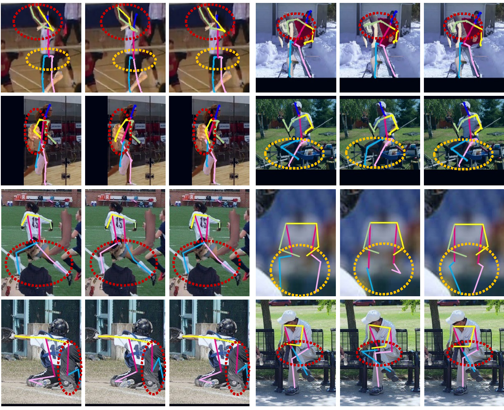

# **Introduction**
Official code repository for the paper:
**MoEPose: Mixture of Experts Learning for Occluded Human Pose Estimation**

# **News**
2023/12/19 Code is open source.

2023/12/19 Dataset is open source.

# **Abstract**:

This paper presents MoEPose, a mixture of experts learning approach for occluded human pose estimation to address the challenges of accurately estimating keypoint coordinates in scenarios where the human body is partially or fully occluded. MoEPose comprises two parallel networks for mutual learning, namely the general network (GNet) and the coupled expert network (ENet). The general network (GNet) processes the normal images and summarizes the learned knowledge, while the coupled expert network (ENet) is tailored specifically for handling occlusion. By performing mutual learning between these two networks, MoEPose is able to effectively address the issue of occlusion in human pose estimation.
To facilitate network learning, we construct paired samples comprising both normal and occluded images, resulting in the creation of two benchmarks for occluded human pose estimation: C-COCO and C-MPII. Additionally, due to its model-agnostic nature, MoEPose is applicable to a broad range of neural network models. Experimental results from synthetic and real-world benchmarks demonstrate that MoEPose offers significant improvements in handling occlusions. We further conduct experiments on face alignment and recognition tasks to illustrate the superior performance of MoEPose.

# **Visualization Results**:
Comparisons of the visualization of results on human pose estimation. The first two rows are the results of C-MPII, and the last two rows are the results of C-COCO. The first column is the real labeled human bodies, the second column is the results of HRNet~\cite{sun2019deep}, and the third column is the results of the ENet of D-Slope+HRNet. The red dotted line represents the occluded cases of pose estimation caused by the addition of human body patches, and the yellow dotted line circles challenging cases that are inherent in MPII.

    

# **Dataset**:
If you need to use the dataset we produced, please contact the author email address: zhanghao520@stu.xjtu.edu.cn. All commercial use of the dataset is prohibited, except for research work.

# **Acknowledgement**:
This project is developed based on the [HRFormer](https://github.com/HRNet/HRFormer) , [MMPOSE](https://github.com/open-mmlab/mmpose)
